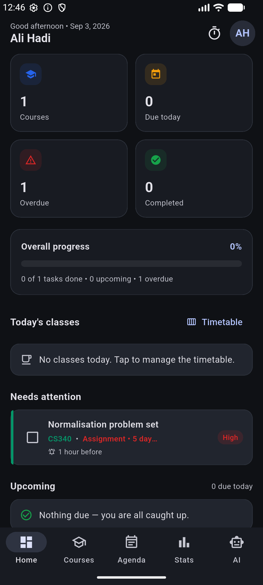
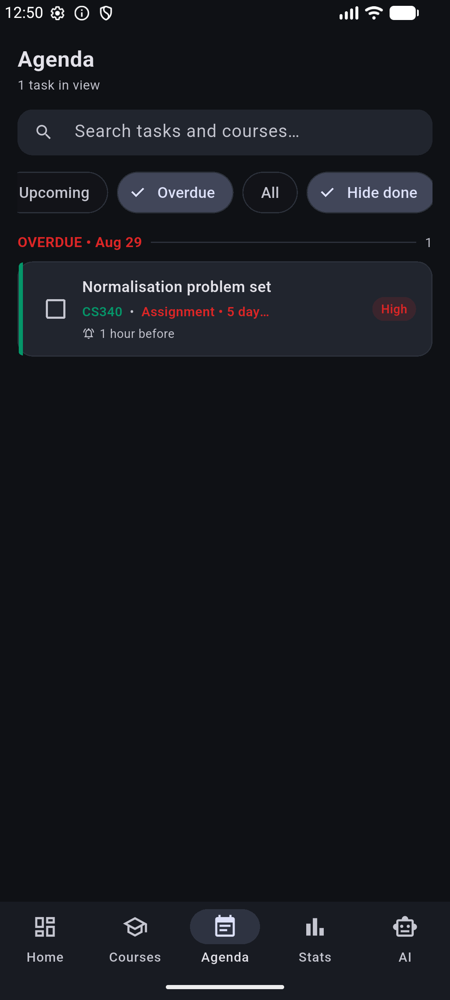
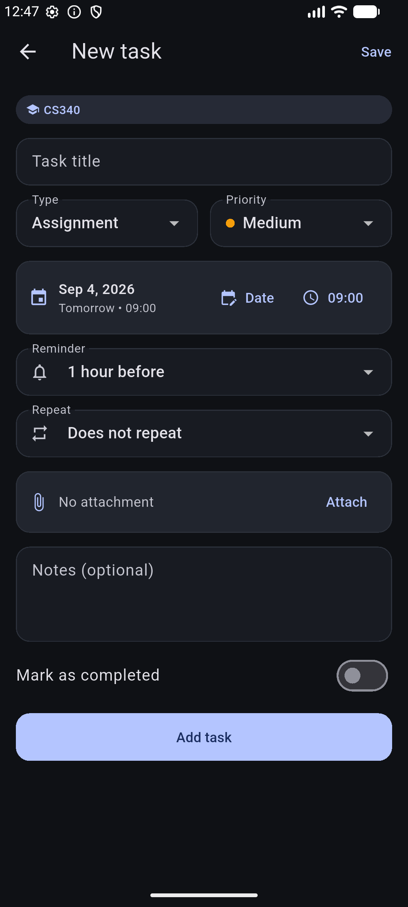
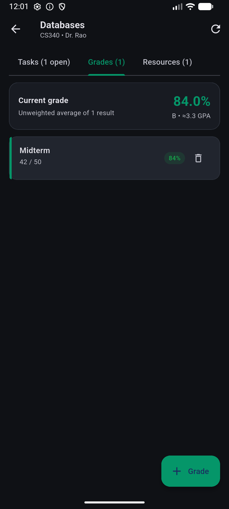
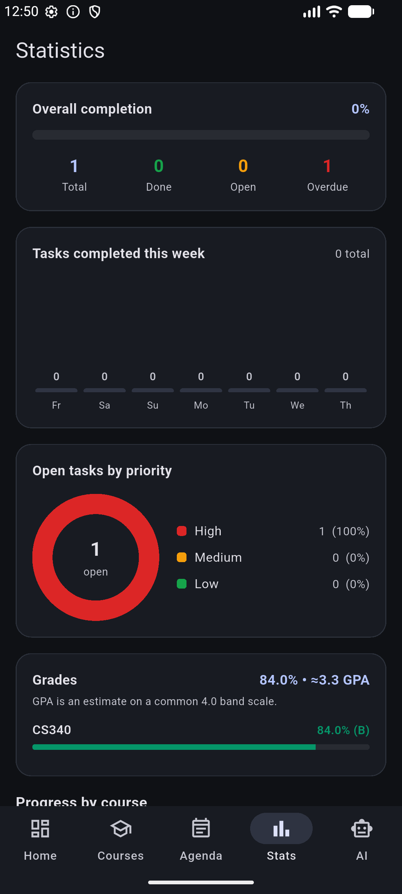
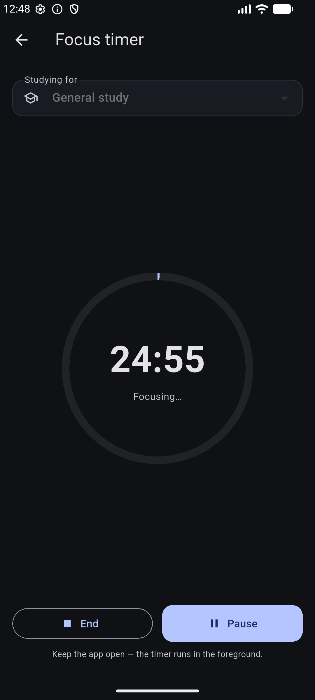
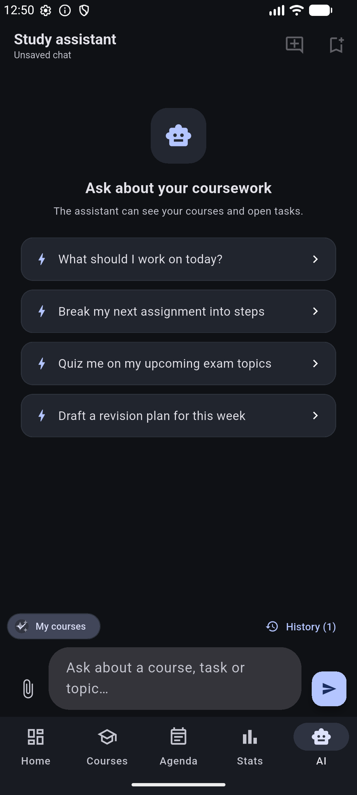

# UniMate 🎓

**UniMate is a study planner for university students, built with Flutter.**
It keeps a whole semester in one place: your courses, every assignment and
exam, your weekly class timetable, your grades, and how much focused study
time you actually put in — with an AI study assistant that knows your real
workload and can plan your week for you.

Everything is stored **locally on your device** in SQLite. Nothing leaves
your phone except the messages you choose to send to the AI assistant.

## Screenshots

| Dashboard | Agenda | Task editor |
| :---: | :---: | :---: |
|  |  |  |

| Grades | Statistics | Focus timer | AI assistant |
| :---: | :---: | :---: | :---: |
|  |  |  |  |

## What it does

**📋 Plan your coursework.** Add your courses (colour-coded, per semester)
and give each one its tasks: assignments, exams, quizzes, projects and
readings, each with a priority, notes, an optional file attachment, and a due
date *and time*. Tasks can repeat daily, weekly, bi-weekly or monthly —
completing one automatically creates the next occurrence. Swipe a task right
to complete it, left to delete it; every destructive action has an Undo.

**🗓 See your week at a glance.** The Agenda gathers every task from every
course, grouped by day, with quick filters (today, next 7 days, upcoming,
overdue) and full-text search. The weekly Timetable holds your lecture and
lab slots, and today's classes appear on the dashboard each morning. The
dashboard's counters are shortcuts — tapping "Overdue" jumps straight to the
overdue agenda.

**🔔 Never miss a deadline.** Each task can schedule a local notification a
chosen interval before it is due. Reminders survive restarts and device
reboots, and an optional daily check-in pings you at a time you pick. The
whole app refreshes itself whenever data changes — no refresh buttons.

**🎯 Track how you're really doing.** Record assessment results with their
weight in the final grade and UniMate shows a live weighted average, letter
grade and estimated 4.0-scale GPA per course. The Statistics screen adds a
7-day completion chart, an open-tasks-by-priority donut, per-course progress
bars and your focused-study hours. A streak banner keeps you honest about
showing up daily, and the Pomodoro-style Focus timer banks studied minutes
per course.

**🤖 Ask the AI assistant.** The built-in chat (Google Gemini) sees your
actual courses, open tasks and class schedule, so "what should I work on
tonight?" gets a real answer. Ask it to plan your week and it proposes
concrete tasks that you review in a checklist and add with one tap. It reads
attached images and PDFs, and every conversation can be saved and reopened.

**🔒 Keep your data yours.** Accounts are local, with salted-hash passwords
and per-account data separation. Finished semesters can be archived without
deleting anything, and the whole account exports to a single JSON backup you
can import on any device. Light, dark and system themes throughout.

## Getting started

```bash
flutter pub get
```

Create the environment file (it is git-ignored, but `pubspec.yaml` declares
it as an asset, so it **must exist** or the build fails):

```bash
cp .env.example .env
```

To enable the AI assistant, put a
[Google AI Studio key](https://aistudio.google.com/app/apikey) in it:

```
GEMINI_API_KEY=your-key-here
```

Leaving it empty is fine — the app runs and the AI tab explains that the key
is missing.

Run it:

```bash
flutter run
```

Supported targets: Android, iOS, Windows, macOS, Linux. Desktop builds use
`sqflite_common_ffi`, initialised automatically at start-up. Reminders are
available on Android, iOS and macOS.

## Tests

```bash
flutter test
```

The suite covers password hashing, model serialisation, date helpers, the
grade and streak maths, the AI task-suggestion parser, and the storage layer
against a real SQLite file: per-account scoping, task counters, cascade
deletes, recurring-task roll-over, backup round-trips, and every schema
migration path.

## Project layout

```
lib/
  core/          design tokens, date helpers, password hashing
  db/            schema, migrations, one storage module per table
  models/        Course, Task, Grade, ClassSession, Resource, Chat…
  providers/     auth/session, settings, tab navigation, data refresh, Gemini client
  services/      notifications, task actions, backup, AI task parser, study context
  screens/       dashboard, courses, agenda, timetable, focus timer, stats, AI, settings
  widgets/       shared tiles, pills, charts, empty states
```

### Database

SQLite, currently at **version 5**. Upgrades run automatically on the first
launch after an update, are safe from any older version, and every migration
path is covered by tests.

| Version | Change |
| --- | --- |
| 1 | `courses`, `tasks`, `resources` |
| 2 | `users` |
| 3 | per-account data, salted password hashes, task notes + reminders, chat history |
| 4 | `class_sessions` + `grades`, recurring tasks, attachments, course archiving |
| 5 | `study_sessions` (focus timer) |
